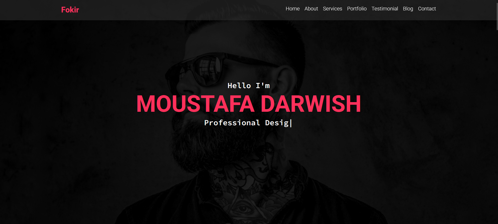
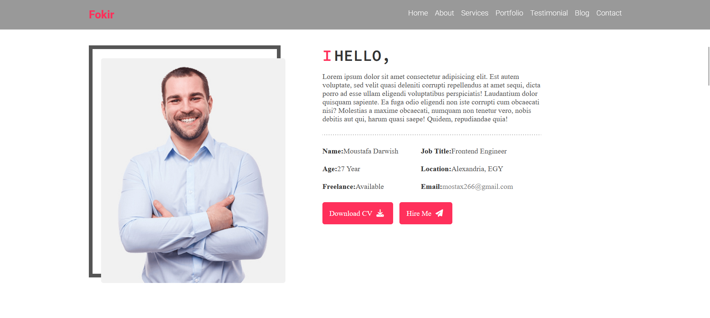
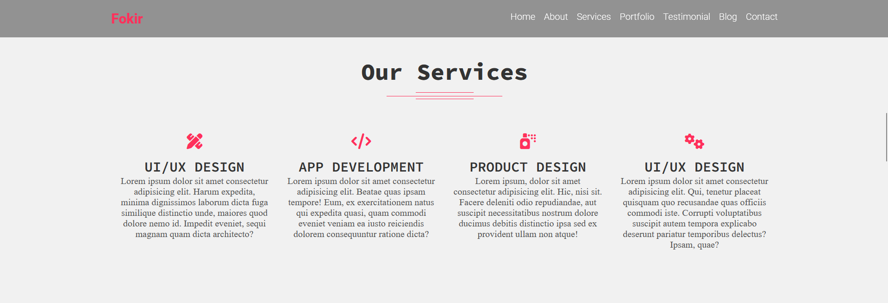
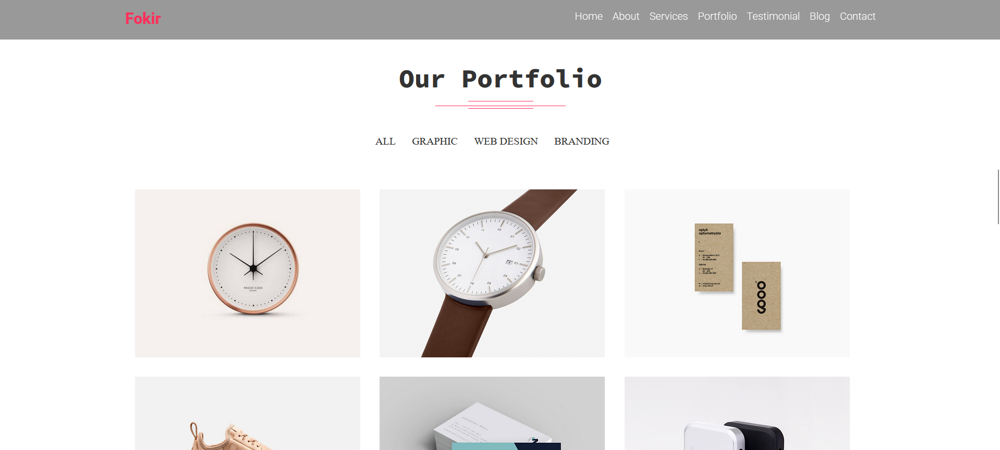
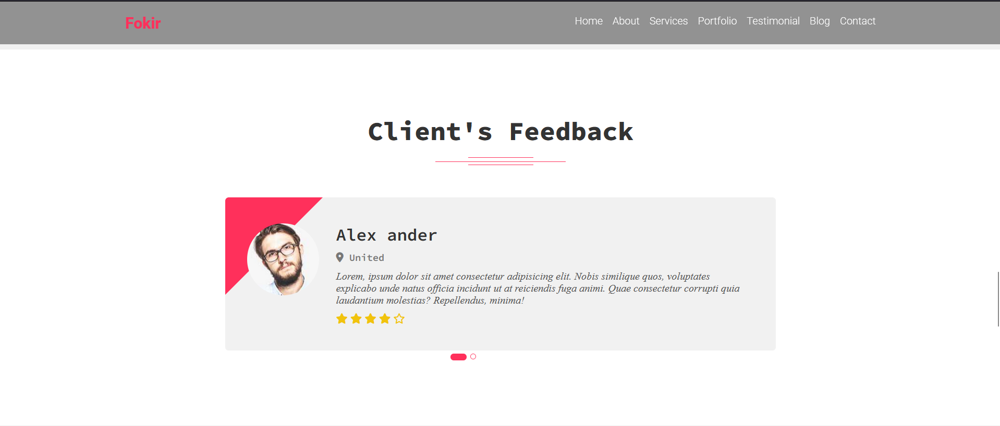
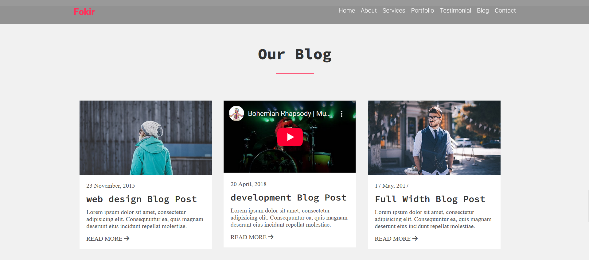
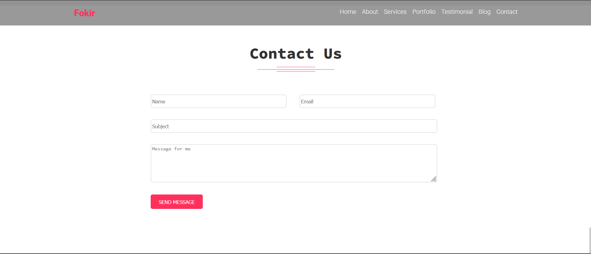

  

    
    
  

  <h3 align="center">FOKIR</h3>
  <h2>A Portfolio website to Showcase work</h2>

## Live Site: https://singular-taiyaki-45109e.netlify.app/

## <a name="features">🔋 Add ons</a>

👉 **Fully Responsive**

